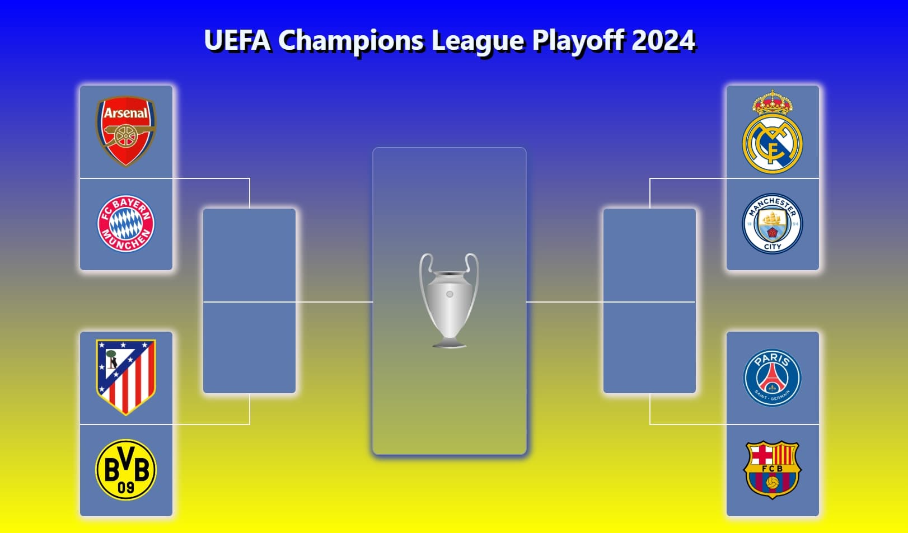
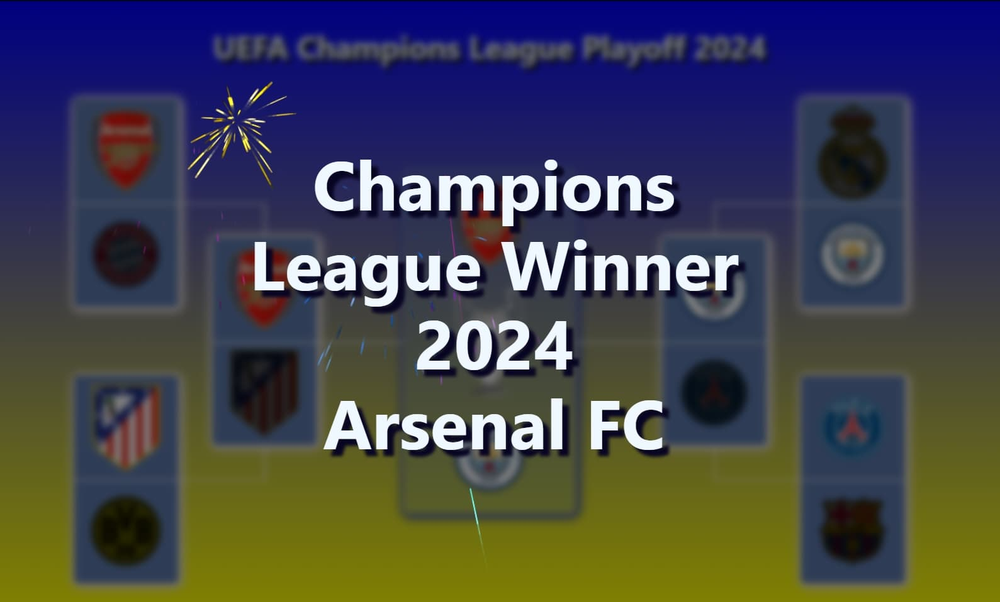

# UEFA Champions League Playoff App

This is a simple application written in React that allows users to simulate and
determine the winner of the UEFA Champions League playoff matches starting from
the 1/4 finals stage.

## Screenshots

#### Tournament Bracket

#### Winner

## Features

- **Simulation Mode**: Users can simulate UEFA Champions League matches from the
  1/4 finals stage to determine the ultimate winner of the tournament.

- **Responsive Layout**: The application features a responsive layout that
  adapts seamlessly to various screen sizes, including mobile, tablet, and
  desktop resolutions.

- **Beautiful Animation**: Fireworks animation library was utilized to add
  stunning visual effects and animations to announce the Champions League winner
  in an impressive and captivating manner.

### Technologies Used

- **React**: The application is built using React, a popular JavaScript library
  for building user interfaces.

- **Fireworks Animation Library**: The Fireworks animation library was
  incorporated to create visually appealing animations for announcing the
  Champions League winner.

### Credits

- **React**: https://react.dev/

- **Fireworks Animation Library**: https://fireworks.js.org

### Author

Max Korovchenko
